# Programming Practical 8 - Deploying a VLM chatbot

In this practical session, you will build a **chatbot** end-to-end using a pre-trained **Vision-Language Model** and deploy it on Google Cloud Platform to make it accessible from the internet. In particular, you will:

* serve [SmolVLM-256M-Instruct](https://huggingface.co/HuggingFaceTB/SmolVLM-256M-Instruct) behind a clean **REST API**;
* build a friendly **Gradio** chat UI that talks to that API;
* package both as **Docker images** and orchestrate them with **docker-compose**;
* deploy the application on Google Cloud Platform to make it accessible from the any computer with an internet connection.

# Part 1: Building the VLM chatbot

## 1. Meet SmolVLM — the `smolvlm_intro.ipynb` notebook

Before we wrap anything in HTTP, let's load the model itself and talk to it directly. We'll do this in Google Colab so you don't have to set up anything locally — the notebook needs a fresh Python kernel with `transformers`, `torch`, and `pillow`, and Colab gives you exactly that for free.

**[➡ Open `smolvlm_intro.ipynb` in Colab](https://colab.research.google.com/github/paulnovello/Advanced-AI/blob/main/PP8_API_Docker/smolvlm_intro.ipynb)**

It's a short, linear notebook (~15 cells) — run the cells in order. In it you will:

1. Load `SmolVLM-256M-Instruct` with `AutoProcessor` and `AutoModelForVision2Seq`.
2. See why we use the **instruct**-tuned variant rather than the base model.
3. Discover the `{role, content}` conversation shape — `system / user / assistant`.
4. See how SmolVLM internally consumes the conversation as a list of **content blocks** (`{"type": "text", ...}` / `{"type": "image"}`), and what `processor.apply_chat_template(...)` does with it.
5. Generate text, then generate with an attached image.
6. Collapse it all into two functions: `load_model()` and `generate(messages, image, max_new_tokens, temperature)`.


## 2. From a notebook to a product — why a REST API?

OK, you just got SmolVLM chatting in a notebook. That's plenty for a tinker session, but it doesn't survive the moment you want to *do* something with it. Share it with a colleague who doesn't have a Colab tab open? Put it behind a friendly web UI? Run it on a beefier machine while a laptop sits in front of you? Have a mobile app and a CLI talk to the same model? The single-notebook-on-Colab story breaks at every one of those boundaries.

The professional answer is to hide the model behind a **REST API** and have every consumer (UI, CLI, mobile, another service…) call that API over HTTP.

> **A REST API** is a thin HTTP layer in front of some logic. Clients send a structured request (typically JSON, over `GET`/`POST`/etc. to a specific URL), the server runs whatever it has to run, and answers with a structured response. The internals — which model, which library, which language — are completely hidden behind that contract.

```
┌────────────────────────┐    HTTP/JSON    ┌────────────────────────┐
│      Gradio UI         │ ──────────────► │       FastAPI          │
│                        │                 │                        │
│  - holds the history   │ ◄────────────── │  - loads SmolVLM       │
│  - sends requests      │                 │  - generates replies   │
│  - port 7860           │                 │  - port 8000           │
└────────────────────────┘                 └────────────────────────┘
```

Why does this split matter?

* **Decoupling.** The UI knows nothing about PyTorch, transformers or which model is running. It only knows how to send a JSON body and parse a JSON response. Tomorrow we swap SmolVLM for SmolVLM2 — the UI doesn't change a single line.
* **Updates.** UI iterations (CSS, layout, new buttons) don't require reloading the model. The model is loaded **once** at API startup and serves thousands of requests.
* **Reusability.** Any client — a CLI, a notebook, a mobile app, another service — can hit the same API. The Gradio UI is just one of many possible consumers; the Colab notebook you just used is another.
* **Scaling.** If the model is the bottleneck, run more API replicas behind a load balancer. The UI does not need to scale at the same rate.
* **Testability.** With a `curl` and a JSON payload, you can test the model service in isolation. No browser, no front-end, no flakiness.

This is the same idea as the classic *separation of concerns* between view and controller: the view renders, the controller computes.

We're also going to make a **deliberate** design choice: the API is **stateless**. It never remembers a previous conversation between requests. Conversation history lives on the client (the Gradio UI), and is re-sent in full on each call. This is the simplest model, makes the API horizontally scalable, and matches how chat APIs like OpenAI's work.


## 3. Project setup

For the rest of the practical we move off Colab and back to your laptop — the API and UI need to be processes you can spin up, restart, and eventually package as Docker containers.

Everything for this practical lives in `PP8_API_Docker/` — that's where you'll work for the rest of the session.

We use [uv](https://docs.astral.sh/uv/) as our Python package manager. At this point in the course you should already be familiar with it — it's a fast, modern replacement for `pip` + `venv` + `pip-tools` rolled into a single tool. We'll declare dependencies in a `pyproject.toml` per service; no `requirements.txt`.

If you don't have `uv` yet:

```bash
# macOS / Linux
curl -LsSf https://astral.sh/uv/install.sh | sh

# Windows (PowerShell)
powershell -ExecutionPolicy ByPass -c "irm https://astral.sh/uv/install.ps1 | iex"
```

We'll split the project into **two sub-projects**, each one defining a service of its own (its code, its own `pyproject.toml`, its own dependencies):

```
PP8_API_Docker/
├── smolvlm_intro.ipynb  # the Colab notebook you just worked through
├── api/                 # the model service
│   ├── main.py
│   ├── model.py
│   └── schemas.py
└── ui/                  # the user interface, talks to the API over HTTP
    ├── app.py
    └── client.py
```

The clean separation between the two folders mirrors the clean separation between the two services: the API knows nothing about Gradio, the UI knows nothing about PyTorch.


## 4. The API

The API has one job: take a conversation (optionally with an image), call your `generate()` from the notebook, and return the next assistant message. We split the implementation across three files:

* **`schemas.py`** — the data contract (request and response shapes).
* **`model.py`** — `load_model()` plus `generate()`, lifted verbatim from the notebook.
* **`main.py`** — the FastAPI app: HTTP endpoints, image decoding, history truncation.

### 4.1 The contract — `schemas.py`

The first thing to nail down for any API is its **contract**: the exact shape of requests and responses. We declare it with [Pydantic](https://docs.pydantic.dev/) typed models — FastAPI will validate every incoming body against them automatically, return clean 422 errors on bad input, and generate OpenAPI docs at `/docs` for free.

`ChatMessage` is just the notebook's `{role, content}` dict with a class wrapped around it. Everything else is API-side bookkeeping: optional image bytes, generation knobs, a history bound.

Create `api/schemas.py`:

```python
from typing import Literal

from pydantic import BaseModel, Field


# One message in the conversation.
# `Literal[...]` restricts `role` to exactly these three strings — anything else
# triggers a 422 response automatically.
class ChatMessage(BaseModel):
    role: Literal["system", "user", "assistant"]
    content: str


# The body of a POST /chat request.
# `Field(...)` is Pydantic's way to attach metadata to a field — here a default
# value plus `ge` (greater-or-equal) and `le` (less-or-equal) bounds that are
# also enforced at validation time. A request with `temperature=99` is rejected
# without ever reaching our code.
class ChatRequest(BaseModel):
    messages: list[ChatMessage]                                    # full history sent by the client
    image_base64: str | None = None                                # optional, attached to the LAST user message
    max_new_tokens: int = Field(default=256, ge=1, le=2048)        # generation budget
    temperature: float = Field(default=0.7, ge=0.0, le=2.0)        # 0 = greedy, >0 = sampling
    max_turns: int = Field(default=8, ge=1, le=32)                 # history truncation


# What we return.
class ChatResponse(BaseModel):
    reply: str
    generation_time_ms: int
```

Take a moment to read through this. A `ChatRequest` is a list of messages, plus an optional base64-encoded image, plus a few generation knobs. A `ChatResponse` is just the model's reply and how long it took.

Notice that the **image is sent as a base64 string inside JSON**. There are other ways (`multipart/form-data` with a file part), but base64 is the simplest to handle on both sides and stays inside a single JSON payload.

### 4.2 The model wrapper — `model.py`

`model.py` is the notebook's two functions and nothing else: `load_model()` and `generate()`. Anything that wants to talk to SmolVLM goes through these — the rest of the API doesn't care whether the model is local PyTorch, an OpenAI call, or something we haven't invented yet.

Drop the code you ended the notebook with into `api/model.py`:

```python
from __future__ import annotations

import logging

import torch
from PIL import Image
from transformers import AutoModelForVision2Seq, AutoProcessor

logger = logging.getLogger(__name__)
MODEL_ID = "HuggingFaceTB/SmolVLM-256M-Instruct"

# Module-level singletons — populated once by load_model() and reused by every request.
_processor: AutoProcessor | None = None
_model: AutoModelForVision2Seq | None = None
_device: str = "cpu"


def load_model() -> None:
    """Download (first time) and load SmolVLM into memory. Idempotent."""
    global _processor, _model, _device
    if _model is not None:
        return                                              # already loaded — nothing to do
    if torch.cuda.is_available():
        _device, dtype = "cuda", torch.bfloat16             # GPU: smaller dtype, faster
    else:
        _device, dtype = "cpu", torch.float32               # CPU: float32 is the safe choice
    logger.info("Loading %s on %s", MODEL_ID, _device)
    _processor = AutoProcessor.from_pretrained(MODEL_ID)    # tokenizer + image preprocessor in one object
    _model = AutoModelForVision2Seq.from_pretrained(MODEL_ID, torch_dtype=dtype).to(_device)
    _model.eval()                                           # disable dropout etc., we're only doing inference


def generate(
    messages: list[dict],
    image: Image.Image | None = None,
    max_new_tokens: int = 256,
    temperature: float = 0.7,
) -> str:
    has_image = image is not None
    last_user_idx = max(
        (i for i, m in enumerate(messages) if m["role"] == "user"), default=-1
    )

    # SmolVLM-specific: convert {role, content: str} → SmolVLM's content-block format.
    formatted: list[dict] = []
    for i, m in enumerate(messages):
        if m["role"] == "user" and i == last_user_idx and has_image:
            content = [{"type": "image"}, {"type": "text", "text": m["content"]}]
        else:
            content = [{"type": "text", "text": m["content"]}]
        formatted.append({"role": m["role"], "content": content})

    prompt = _processor.apply_chat_template(formatted, add_generation_prompt=True)
    inputs = _processor(
        text=prompt,
        images=[image] if has_image else None,
        return_tensors="pt",
    ).to(_device)

    do_sample = temperature > 0.0
    with torch.no_grad():
        output_ids = _model.generate(
            **inputs,
            max_new_tokens=max_new_tokens,
            do_sample=do_sample,
            temperature=temperature if do_sample else 1.0,
        )
    input_len = inputs["input_ids"].shape[1]
    return _processor.decode(output_ids[0, input_len:], skip_special_tokens=True).strip()
```

No `format_messages` helper at module scope, no `truncate_history` — the content-block conversion stays folded into `generate()` (the only thing that needs it), and history truncation is an API-level concern that lives in `main.py`, next.

### 4.3 The FastAPI app — `main.py`

[**FastAPI**](https://fastapi.tiangolo.com/) is a modern Python web framework: you declare endpoints with a decorator, FastAPI takes care of the HTTP plumbing, the request validation (against your Pydantic models) and even auto-generates interactive documentation at `/docs`.

Our API exposes two endpoints:

* **`GET /health`** — a trivial liveness check. `GET` is the HTTP method for "give me something"; we use it to *read* the health status. We'll reuse this later as a Docker healthcheck.
* **`POST /chat`** — the real workhorse. The API expects a JSON body matching `ChatRequest` (messages + optional image + generation knobs) and returns a JSON body matching `ChatResponse` (`reply` + `generation_time_ms`). `POST` is the HTTP method for "I'm sending you data" — appropriate here because the request carries a non-trivial body (the conversation, potentially a large base64 image).

(Quick recap on the two methods: `GET` is for *reading*, has no body, can be cached, must be idempotent — i.e. safe to repeat. `POST` is for *creating / submitting work*, carries a request body, and may have side effects.)

Two pieces of API-level plumbing live in this file alongside the endpoints:

* **`truncate_history`** — a context-window safety net. The model has a finite input size; left unchecked, a long conversation would eventually overflow it. We keep an optional leading system message plus the most recent `2 * max_turns` user/assistant entries (one *turn* = one user message + one assistant reply, hence the factor of 2). This is an HTTP-level concern (how big a history are we willing to accept and process?), not a model-internal one — so it lives here, not in `model.py`.
* **A one-line Pydantic-to-dict unpack** before calling `model.generate()`. `model.generate()` speaks plain `{role, content}` dicts; `ChatMessage` is the same shape wrapped in Pydantic for validation. The conversion is one comprehension.

Create `api/main.py`:

```python
import base64, io, logging, time
from contextlib import asynccontextmanager
from fastapi import FastAPI, HTTPException
from PIL import Image

import model
from schemas import ChatMessage, ChatRequest, ChatResponse

logging.basicConfig(level=logging.INFO)


# `lifespan` is FastAPI's startup/shutdown hook. Anything before `yield` runs
# ONCE, before the server starts accepting requests; anything after `yield`
# runs on shutdown. We load the model here so the first incoming request does
# NOT pay the multi-second model-loading tax.
@asynccontextmanager
async def lifespan(app: FastAPI):
    model.load_model()
    yield


app = FastAPI(title="VLM Chatbot API", lifespan=lifespan)


# A GET endpoint — no body, just returns a JSON object.
@app.get("/health")
def health() -> dict[str, str]:
    return {"status": "ok"}


def truncate_history(messages: list[ChatMessage], max_turns: int) -> list[ChatMessage]:
    """Keep any leading system message + the last 2*max_turns user/assistant entries."""
    system_prefix = [m for m in messages[:1] if m.role == "system"]
    rest = messages[len(system_prefix):]
    return system_prefix + rest[-(2 * max_turns):]


# A POST endpoint — FastAPI parses the JSON body into a ChatRequest for us.
# If the body is invalid (wrong types, out-of-range temperature, etc.), FastAPI
# returns a 422 response automatically and our function is never called.
@app.post("/chat", response_model=ChatResponse)
def chat(req: ChatRequest) -> ChatResponse:
    if not req.messages:
        # Validation that Pydantic can't express: a non-empty list. We raise
        # an HTTPException, which FastAPI turns into a proper HTTP error response.
        raise HTTPException(status_code=400, detail="messages must be non-empty")

    # Decode the optional image from base64 → bytes → PIL.
    image: Image.Image | None = None
    if req.image_base64:
        try:
            raw = base64.b64decode(req.image_base64)
            image = Image.open(io.BytesIO(raw)).convert("RGB")
        except Exception as e:
            raise HTTPException(status_code=400, detail=f"invalid image_base64: {e}") from e

    # Trim, unpack Pydantic to plain dicts, generate, measure how long it took.
    trimmed = truncate_history(req.messages, req.max_turns)
    messages_for_model = [{"role": m.role, "content": m.content} for m in trimmed]

    start = time.perf_counter()
    reply = model.generate(
        messages=messages_for_model,
        image=image,
        max_new_tokens=req.max_new_tokens,
        temperature=req.temperature,
    )
    elapsed_ms = int((time.perf_counter() - start) * 1000)
    return ChatResponse(reply=reply, generation_time_ms=elapsed_ms)
```

### 4.4 Dependencies — `pyproject.toml`

Create `api/pyproject.toml` to declare the dependencies:

```toml
[project]
name = "vlm-chatbot-api"
version = "0.1.0"
requires-python = ">=3.11"
dependencies = [
  "fastapi>=0.115,<0.116",
  "uvicorn[standard]>=0.32,<0.33",
  "pydantic>=2.9,<3.0",
  "transformers>=4.47,<4.50",
  "torch>=2.5,<2.6",
  "torchvision>=0.20,<0.21",
  "pillow>=11.0,<12.0",
  "numpy>=1.26,<3.0",
]

# Pull torch/torchvision from the CPU-only PyTorch index (much smaller, no CUDA)
[tool.uv.sources]
torch = { index = "pytorch-cpu" }
torchvision = { index = "pytorch-cpu" }

[[tool.uv.index]]
name = "pytorch-cpu"
url = "https://download.pytorch.org/whl/cpu"
explicit = true
```

Also add a `.python-version` file with `3.11` in it — that pins the Python version `uv` will use, regardless of what's already on the system.

### 4.5 Run it!

From the `api/` directory:

```bash
uv sync                                          # create .venv, install deps
uv run uvicorn main:app --reload --port 8000     # start the API
```

The first run will download the model (~500 MB) into your Hugging Face cache. After the line `Application startup complete.` you can hit the API.

Open another terminal and try the health endpoint:

```bash
curl http://localhost:8000/health
# → {"status":"ok"}
```

Now try a real chat request:

```bash
curl -X POST http://localhost:8000/chat \
  -H "Content-Type: application/json" \
  -d '{"messages":[{"role":"user","content":"Hello, who are you?"}], "max_new_tokens": 50}'
```

You should see a JSON response with `reply` and `generation_time_ms`. **Congratulations — your model is now a service.**

FastAPI also gives you free interactive documentation at <http://localhost:8000/docs> — open it in a browser, you can try the endpoints directly from the UI.


## 5. Playing with the API: history and images

`curl` is fine for a smoke test but cumbersome for multi-turn conversations and unsuitable for sending images. Open the provided notebook `PP8_API_Docker/test_api.ipynb` and run the cells one by one.

You will:

1. Send a single text message and parse the response.
2. Build a **multi-turn** conversation by appending the assistant's reply to the `messages` list and re-sending the whole thing on the next turn. This is the *client-side history* pattern we mentioned earlier.
3. Encode a PIL image to **base64** and send it with a question about its content.
4. Combine both: ask follow-up questions about an image.

Keep the notebook open as a debugging aid for the rest of the session. Whenever the UI does something unexpected, you can reproduce the request in the notebook to figure out whether the bug is in the API or in the UI.


## 6. The Gradio UI

Now that the model service is up, we will design a UI to interact with it without having to fire up a notebook or hand-type `curl` commands. The UI will also be in charge of **storing the conversation history** on behalf of the user, since the API is stateless.

The UI is a *thin client* — it knows nothing about PyTorch, transformers, or how the model is implemented. It only knows how to call an HTTP endpoint, display the result, and remember what was said before.

### 6.1 The HTTP client — `client.py`

A **client**, in the REST API world, is whatever code calls the API. The browser, a `curl`, the notebook from §5 — all clients. The Gradio app will be another one. We isolate the HTTP call in its own tiny module so the rest of the UI doesn't deal with URLs, JSON or base64 encoding. The benefit is two-fold: cleaner UI code, and a single place to change if the API contract ever evolves.

Create `ui/client.py`:

```python
import base64, io
import requests
from PIL import Image


def _encode_image(image: Image.Image) -> str:
    buf = io.BytesIO()
    image.convert("RGB").save(buf, format="PNG")
    return base64.b64encode(buf.getvalue()).decode("ascii")


def call_api(api_url, messages, image=None, temperature=0.7, max_turns=8,
             max_new_tokens=256, timeout=180):
    payload = {
        "messages": messages,
        "temperature": temperature,
        "max_turns": max_turns,
        "max_new_tokens": max_new_tokens,
    }
    if image is not None:
        payload["image_base64"] = _encode_image(image)
    resp = requests.post(f"{api_url.rstrip('/')}/chat", json=payload, timeout=timeout)
    resp.raise_for_status()
    data = resp.json()
    return data["reply"], int(data["generation_time_ms"])
```

### 6.2 The chat interface — `app.py`

[**Gradio**](https://gradio.app/) is a Python library that lets you build a usable web UI for a model in a few dozen lines. You declare components (textboxes, chatbots, sliders, image uploaders…) and wire them with Python functions; Gradio takes care of the HTML, the JavaScript and serving everything over HTTP. We'll use the low-level `gr.Blocks` API rather than the all-in-one `gr.ChatInterface` because we want the freedom to add a system-prompt textbox, sliders, a latency footer and a clear button.

Create `ui/app.py`:

```python
import os
import gradio as gr
from PIL import Image
from client import call_api

# The address of the API. Reading it from the environment lets us point at a
# different host (e.g. a remote machine) without touching the code — handy for
# local development.
API_URL = os.environ.get("API_URL", "http://localhost:8000")


def _to_api_messages(history, system_prompt):
    """Flatten the chatbot's display history into the API's text-only schema.

    The chatbot may contain non-text entries (image thumbnails); those are
    dropped here because the actual image is sent separately as base64.
    """
    msgs = []
    if system_prompt and system_prompt.strip():
        msgs.append({"role": "system", "content": system_prompt.strip()})
    for entry in history:
        if isinstance(entry["content"], str) and entry["content"].strip():
            msgs.append({"role": entry["role"], "content": entry["content"]})
    return msgs


def on_submit(user_input, chatbot, system_prompt, temperature, max_turns):
    """Called every time the user submits a message in the textbox.

    `chatbot` is the current conversation history (the UI state).
    We return the new history; Gradio re-renders the chatbot from it.
    """
    text = (user_input or {}).get("text") or ""
    files = (user_input or {}).get("files") or []
    if not text.strip() and not files:
        return chatbot, gr.MultimodalTextbox(value=None)

    # Build the new history: append the user's image (if any) and text.
    new_history = list(chatbot)
    image = None
    if files:
        image = Image.open(files[0])
        new_history.append({"role": "user", "content": {"path": files[0]}})
    if text.strip():
        new_history.append({"role": "user", "content": text.strip()})

    # Talk to the API, append the assistant's reply.
    api_messages = _to_api_messages(new_history, system_prompt)
    try:
        reply, elapsed = call_api(
            API_URL, api_messages, image=image,
            temperature=temperature, max_turns=int(max_turns),
        )
        # Latency footer rendered as an italic line under the reply.
        assistant_text = f"{reply}\n\n*Generated in {elapsed} ms*"
    except Exception as e:
        assistant_text = f"⚠️ API error: {e}"

    new_history.append({"role": "assistant", "content": assistant_text})
    return new_history, gr.MultimodalTextbox(value=None)   # also clear the input box


# Build the layout. Every component instantiated inside this `with` block
# becomes part of the UI.
with gr.Blocks(title="VLM Chatbot") as demo:
    gr.Markdown(f"# VLM Chatbot\nModel: **SmolVLM-256M-Instruct** · API: `{API_URL}`")

    with gr.Accordion("System prompt", open=False):
        system_prompt = gr.Textbox(label="System prompt (optional)", lines=2)

    chatbot = gr.Chatbot(type="messages", height=500, label="Chat")
    user_input = gr.MultimodalTextbox(
        file_count="single", file_types=["image"],
        placeholder="Type a message and/or attach an image...",
        show_label=False,
    )
    with gr.Row():
        temperature = gr.Slider(0.0, 1.5, value=0.7, step=0.05, label="Temperature")
        max_turns = gr.Slider(1, 16, value=8, step=1, label="History max turns")
    clear_btn = gr.Button("Clear history", variant="secondary")

    # Wire events to handlers.
    user_input.submit(
        on_submit,
        inputs=[user_input, chatbot, system_prompt, temperature, max_turns],
        outputs=[chatbot, user_input],
    )
    clear_btn.click(lambda: [], outputs=[chatbot])


if __name__ == "__main__":
    port = int(os.environ.get("GRADIO_SERVER_PORT", "7860"))
    share = os.environ.get("GRADIO_SHARE", "0").lower() in {"1", "true", "yes"}
    demo.launch(server_name="0.0.0.0", server_port=port, share=share)
```

A few things to notice:

* `API_URL` is read from an **environment variable**, defaulting to `http://localhost:8000`. We will explain later why exposing this as an env var matters; for now, just remember that the code never hardcodes the API location.
* The UI keeps the conversation history in the `chatbot` state, and **every submit re-sends the whole trimmed history to the API**. This is the price of the stateless design: the API has no memory of its own, so the entire context must travel on every request. A counter-intuitive consequence is that **each new message costs more tokens than the previous one, even when the new message is shorter** — because the *cost* is the size of the *whole* prompt, which keeps growing as the conversation progresses. That's also why `max_turns` exists: it caps the context the API has to chew through on every call.
* `_to_api_messages` strips the non-text entries (image attachments displayed in the chatbot bubble) before sending — the actual image bytes go through `image_base64`.
* The latency returned by the API is appended to each reply as an italic footer (the "latency display" stretch feature). The temperature and max-turns sliders are read on every submit (the other two stretch features).

### 6.3 Dependencies — `pyproject.toml`

In `ui/`:

```toml
[project]
name = "vlm-chatbot-ui"
version = "0.1.0"
requires-python = ">=3.11"
dependencies = [
  "gradio>=5.49,<6.0",
  "requests>=2.32,<3.0",
  "pillow>=11.0,<12.0",
]
```

Same `.python-version` trick: a file with `3.11` in it.

### 6.4 Run it

Make sure the API is still running on port 8000 in another terminal. Then, from `ui/`:

```bash
uv sync
uv run python app.py
```

Open <http://localhost:7860>. Try a text-only message, then attach an image and ask a question about it. Play with the system prompt and the sliders. Click *Clear history* between scenarios.

You now have a working two-process application. The next step is to package it.


## 7. Docker — making the application portable

Right now your app runs because **your** machine has the right Python, the right PyTorch, the right Hugging Face cache, etc. Onboard a new colleague and you'll spend the morning debugging mismatched versions. Deploy to a server and you'll spend the afternoon doing the same.

**Docker** is the standard answer to this class of problem. It is a tool that lets you bundle an application together with its operating system, its Python interpreter, its libraries, its code and its configuration — into a single artifact that runs the same way everywhere. "Works on my machine" turns into "works on every machine".

The vocabulary you need to learn is just three words: **image**, **container**, **Dockerfile**.

* A **Dockerfile** is a *recipe*. It is a plain-text file that lists, line by line, what should go inside our bundle: which Linux to start from, which packages to install, which code to copy, which command to run on startup. It is purely declarative.
* A **Docker image** is the *bundle itself* — a frozen filesystem snapshot built by following the recipe. Images are read-only, layered (each instruction in the Dockerfile creates one layer), and can be stored and shared via registries like [Docker Hub](https://hub.docker.com/).
* A **Docker container** is a *running instance* of an image. The image is the executable; the container is the running process. You can start, stop, kill and delete containers; the image they came from stays untouched. You can run **many containers from the same image** — they are isolated from each other.

The workflow is therefore: write a Dockerfile → `docker build` produces an image → `docker run` starts a container from that image.

Crucially, once a container is running, it behaves like a **small autonomous system** with its own filesystem, its own processes and its own network interface. Whatever is inside the container is invisible from outside unless we explicitly poke a hole — that's why we need to **bind ports**. When the API listens on port 8000 *inside* its container, your laptop browser cannot reach that port directly. The `-p 8000:8000` flag (or `ports:` in compose) tells Docker: "forward the host's port 8000 to the container's port 8000". Without that mapping, the container is invisible.

If Docker is not installed yet, follow [the official guide](https://docs.docker.com/engine/install/). On macOS and Windows you'll install **Docker Desktop**; on Linux you can install the Docker engine directly (and add yourself to the `docker` group, otherwise prefix every command with `sudo`).

### 7.1 Why **two** containers?

A container, again, is just a running instance of an image — a self-contained little box with our application inside. We could put **everything** in a single big box: the API, the UI, all the libraries, all the code. We won't, because:

* **Separation of concerns.** The API needs a heavy stack (PyTorch, transformers, ~1 GB image). The UI only needs Gradio (~200 MB). Mixing them means every UI edit forces re-installing PyTorch.
* **Independent scaling.** In production, you might want 5 replicas of the API behind a load balancer, but only 1 UI.
* **Restart blast-radius.** Restarting the UI to ship a new button shouldn't reload the model. Two containers means restarts are cheap and localized.
* **Different lifecycles.** UI iterates fast (CSS, layout). Model iterates slowly (new checkpoint every few weeks).

The two containers need a way to talk to each other and a way to start together. That's what **docker-compose** is for.

### 7.2 The API Dockerfile (provided)

Remember: a Dockerfile is a recipe. Each line is one step Docker will execute, in order, to build the API image. Once built, we'll `docker run` the image to obtain a running container.

Here is the Dockerfile for the API. Create `api/Dockerfile`:

```dockerfile
FROM python:3.11-slim

# Pull the static uv binary from the official image — fast, multi-arch, no install step
COPY --from=ghcr.io/astral-sh/uv:0.11.8 /uv /uvx /bin/

WORKDIR /app
ENV PYTHONUNBUFFERED=1 \
    HF_HOME=/root/.cache/huggingface \
    UV_LINK_MODE=copy \
    UV_COMPILE_BYTECODE=1 \
    UV_PYTHON_DOWNLOADS=never \
    PATH="/app/.venv/bin:$PATH"

# Install deps FIRST, then copy code. Docker caches by layer:
# this ordering means a code change does not re-install dependencies.
COPY pyproject.toml uv.lock ./
RUN uv sync --frozen --no-install-project

COPY . /app

EXPOSE 8000

# Healthcheck — Docker (and docker-compose) use this to know when the container is "ready".
HEALTHCHECK --interval=10s --timeout=5s --start-period=120s --retries=5 \
  CMD python -c "import urllib.request,sys; sys.exit(0 if urllib.request.urlopen('http://localhost:8000/health').status==200 else 1)"

CMD ["uvicorn", "main:app", "--host", "0.0.0.0", "--port", "8000"]
```

A few things to read carefully:

* The base image is **`python:3.11-slim`** — a stripped-down Debian with Python pre-installed. Multi-architecture (works on Intel and Apple Silicon).
* We **copy the static `uv` binary** from its official image. No `pip install uv` step.
* `uv sync --frozen` installs exactly what's in `uv.lock`. Reproducible builds.
* The `COPY pyproject.toml uv.lock` **before** `COPY . /app` is a critical Docker idiom: dependency layers are cached separately from code layers, so changing `model.py` does not trigger a fresh PyTorch download.
* `EXPOSE 8000` is a piece of metadata declaring which port this container listens on. It does **not** automatically expose anything to the host — that's the job of `-p` (or `ports:` in compose).
* The `HEALTHCHECK` runs every 10 seconds inside the container; we'll use it in compose to gate the UI's startup until the model is loaded.

One last thing before building — create `api/.dockerignore` with this content:

```
__pycache__
*.pyc
*.pyo
.venv
.git
.gitignore
.DS_Store
.idea
.vscode
*.egg-info
```

This file tells Docker which paths to skip when it sends the build context to the daemon. It matters here because `COPY . /app` would otherwise overwrite the freshly-built `/app/.venv` (Linux ELF binaries) with your host's `.venv` (macOS / Windows binaries from when you ran `uv sync` locally), and the container would fail at startup with `exec /app/.venv/bin/uvicorn: no such file or directory`. Note that **Docker only reads `.dockerignore` from the build context root**, so each sub-project (`api/` and `ui/`) needs its own.

Generate the lockfile (once, from `api/`) and build the image:

```bash
cd api
uv lock                                       # generates uv.lock
docker build -t vlm-chatbot-api .
```

(On Linux without docker group, prefix with `sudo`.)

The build will take a few minutes the first time — most of which is downloading PyTorch wheels.

Run it standalone:

```bash
docker run --rm -p 8000:8000 vlm-chatbot-api
```

`-p 8000:8000` maps host port 8000 to container port 8000. The first launch downloads the model (~500 MB) inside the container, then you can hit `http://localhost:8000/health` from your browser.

Stop it with `Ctrl+C`.

### 7.3 Your turn: the Gradio Dockerfile

It's your turn to write `ui/Dockerfile`. The structure is the same as the API's but **simpler**: no healthcheck, no `HF_HOME`, no PyTorch. Don't forget to also create a `ui/.dockerignore` with the same content as the one you wrote in §7.2 — same reason, the host's `.venv` must not leak into the image.

Fill in the blanks:

```dockerfile
FROM python:3.11-slim
COPY --from=ghcr.io/astral-sh/uv:0.11.8 /uv /uvx /bin/

WORKDIR /app
ENV ...                  # PYTHONUNBUFFERED=1, UV_LINK_MODE=copy, UV_COMPILE_BYTECODE=1, PATH=/app/.venv/bin:$PATH

COPY pyproject.toml uv.lock ./
RUN uv sync ...

COPY . /app

EXPOSE ...               # which port does Gradio listen on?

CMD [...]                # how do you start app.py?
```

Generate the lockfile and build:

```bash
cd ui
uv lock
docker build -t vlm-chatbot-ui .
```

If your Dockerfile is correct, the build should complete without errors. (The full solution is at the end of this page.)


## 8. Orchestration with docker-compose

We have two images. We need to:

1. Start both containers in the right order (UI should wait until the API is **ready**, not just **running**).
2. Let them talk to each other.
3. Expose the UI's port to the host so we can open it in a browser.

A `docker-compose.yml` describes all of this declaratively. Create `PP8_API_Docker/docker-compose.yml`:

```yaml
services:
  api:
    build: ./api
    ports:
      - "8000:8000"          # exposed to the host for curl during dev
    volumes:
      - huggingface-cache:/root/.cache/huggingface   # persist the model download
    healthcheck:
      test:
        - CMD
        - python
        - -c
        - "import urllib.request,sys; sys.exit(0 if urllib.request.urlopen('http://localhost:8000/health').status==200 else 1)"
      interval: 10s
      timeout: 5s
      start_period: 120s
      retries: 5

  ui:
    build: ./ui
    ports:
      - "7860:7860"
    environment:
      API_URL: http://api:8000          # <- this is the magic line
    depends_on:
      api:
        condition: service_healthy

volumes:
  huggingface-cache:
```

The single most important line is:

```yaml
environment:
  API_URL: http://api:8000
```

Inside the compose network, **each service is reachable by its name**. The UI does not call `http://localhost:8000` (that would be the UI container itself), nor `http://host.docker.internal:8000` (which is OS-specific and a real headache on Linux). It calls **`http://api:8000`** — Compose's built-in DNS resolves `api` to the API container's IP.

This is why we made `API_URL` an environment variable from the very beginning: same code, different value, same machine or remote server.

A few other things worth noting:

* `depends_on` with `condition: service_healthy` means the UI is **not started** until the API's healthcheck passes. Without this, the UI would come up immediately, try to call the API while the model is still loading, and fail.
* The **named volume** `huggingface-cache` survives `docker compose down`. Subsequent boots reuse the downloaded model.
* We don't pin a `version:` at the top — Compose v2 ignores it and the file stays forward-compatible.


## 9. Run the whole stack

From the `PP8_API_Docker/` directory:

```bash
docker compose up --build
```

The first launch is the slow one: building the two images, downloading the model. Watch the logs — the UI container will sit in "waiting" until the API healthcheck reports `healthy`.

Once both are up, open <http://localhost:7860> in your browser. You're now hitting:

```
Browser → host:7860 → UI container → "api" hostname → API container → SmolVLM
```

— and everything runs inside Docker. Test it the same way you did in the local setup: text chat, image chat, system prompt, clear button.

To shut everything down:

```bash
docker compose down
```

Add `-v` to also delete the named volume (and re-download the model on the next boot):

```bash
docker compose down -v
```


## 10. Bonus tips

### 10.1 What didn't we have to change?

Compare the local-only setup with the dockerized one:

* The **API code** is identical. It binds `0.0.0.0:8000` either way.
* The **UI code** is identical. The only difference is that `API_URL` is set to `http://api:8000` by compose instead of defaulting to `http://localhost:8000`.

That's it. **No code edits between "works on my machine" and "works in Docker."** This is the dividend of putting the configuration in environment variables from day one.

### 10.2 Demoing remotely with a tunnel

If your machine is on a network where your audience can't reach `localhost:7860`, you can ask Gradio to create a public tunnel via `gradio.live`. In local development:

```bash
GRADIO_SHARE=1 uv run python app.py
```

You'll see a `https://xxxxxxx.gradio.live` URL in the logs, valid for one week. The same env var works inside the UI container — pass `GRADIO_SHARE=1` in the compose `environment:` section if you want the dockerized version to publish a public URL.

(Side note: when share is enabled, Gradio forwards the public URL to the local Gradio server. Make sure no other process — e.g. an IDE devserver — is squatting port 7860 on your machine, otherwise the tunnel will hit the wrong process.)

### 10.3 GPU support

SmolVLM-256M is **comfortable on CPU** — that's why the reference Dockerfile uses CPU-only PyTorch wheels. If you wanted to run a bigger model:

* **Linux**: install the NVIDIA Container Toolkit, then add `deploy: { resources: { reservations: { devices: [...] } } }` to the api service in compose.
* **macOS (Apple Silicon)**: no GPU passthrough is currently possible in Docker — the model runs on CPU inside the container even if your host has an MPS-capable GPU.
* **Windows**: GPU passthrough works through WSL2 + Docker Desktop, same NVIDIA Container Toolkit story as Linux.

In all cases you'd also need to change `[tool.uv.sources]` to pull the matching CUDA-enabled torch wheel.

### 10.4 Common pitfalls

* **The UI calls `localhost` instead of `api`.** Inside the UI container, `localhost` is the UI container itself, not the API. Always use the service name in compose. The `API_URL` env var should be set to `http://api:8000`.
* **Port conflict on the host.** If another process is already listening on 7860 or 8000, `docker compose up` will fail. Stop the offender (`lsof -i :7860` on macOS/Linux, `netstat -ano | findstr :7860` on Windows) or change the host-side port in the compose mapping (e.g. `"7861:7860"`).
* **The model re-downloads every restart.** You forgot the named volume. Check the `volumes:` section.
* **`OSError: cannot find empty port`** when running Gradio locally — something else (often an IDE like Cursor) is already on 7860. Run `GRADIO_SERVER_PORT=7861 uv run python app.py`.


## 11. Going further

* Add a **streaming** mode: stream tokens as they're generated using FastAPI's `StreamingResponse` and Gradio's `gr.Chatbot` streaming events.
* Ask your favorite coding assistant to design a new UI with Flask and React and replace the current Gradio UI.
* Add **server-side session history** keyed by a session ID — store conversations in Redis, refactor the API to be stateful.
* Add **API-key authentication** so the API can be exposed publicly without being abused.
* Swap SmolVLM for a bigger VLM (e.g. SmolVLM2-2.2B, Phi-3.5-vision) and observe how only the API container changes.


# Part 2: Deploying the VLM chatbot on Google Cloud Platform


Make sure you have completed Part 1 before starting this one.
We will deploy the dockerized VLM chatbot (API + Gradio interface) to Google Cloud Platform to make it accessible from the internet.

## 0. Prerequisites
Make sure you have completed Part 1 and have the project ready.
Make sure that you can run the application locally before starting this tutorial.

## 1. Google cloud account and free coupon code
Click on the link sent by email to redeem your free coupon code (you must use your INSA mail address to redeem it).
Once you have your coupon code, go to [this link](https://console.cloud.google.com/education?pli=1) to get your credits (you will need a Google account, if needed, you can create one using your INSA mail address).
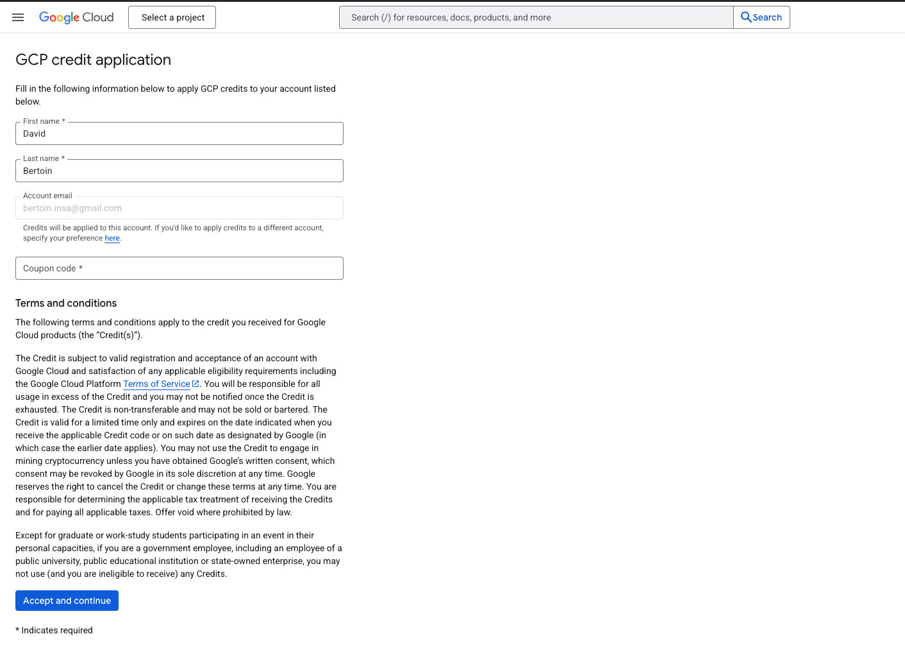

## 2. Create a new instance
On the GCloud homepage, click on the side bar menu on the left and select "Compute Engine" -> "VM instances".
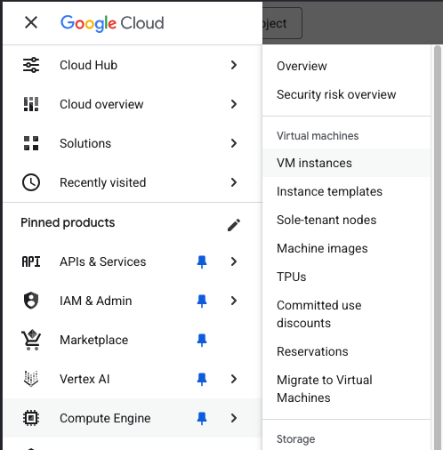  
Then click on the "Create project button", and create a project named _Advanced-AI_. No need to fill in the other fields.
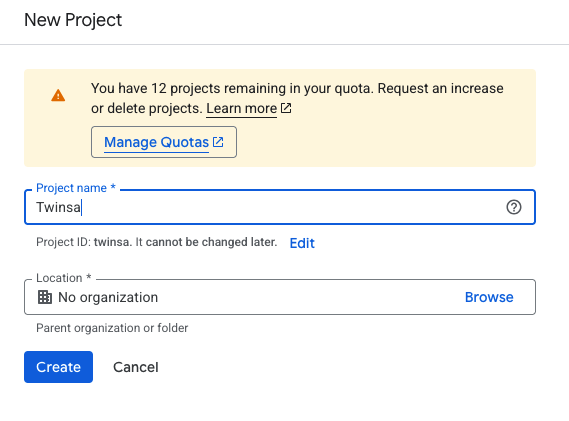  
You should arrive at the following page, click on "Enable API"
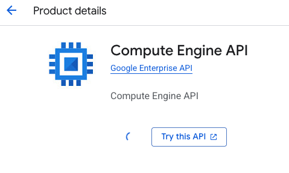  
You should now see a page proposing to create a new instance. Click on "Create instance".
Fill in the following fields in __Machine configuration__ section:
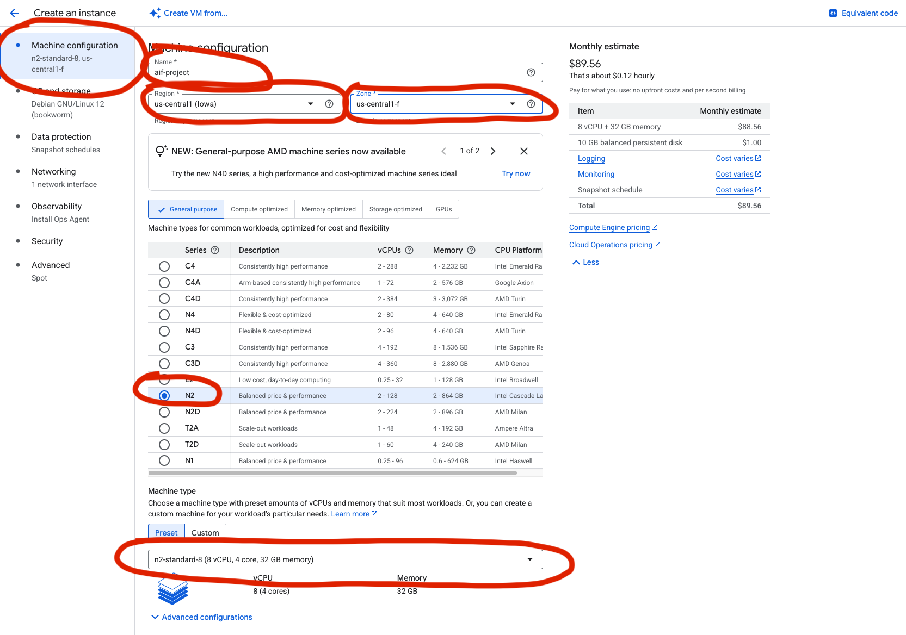  
Then in the __OS and Storage__ section,  
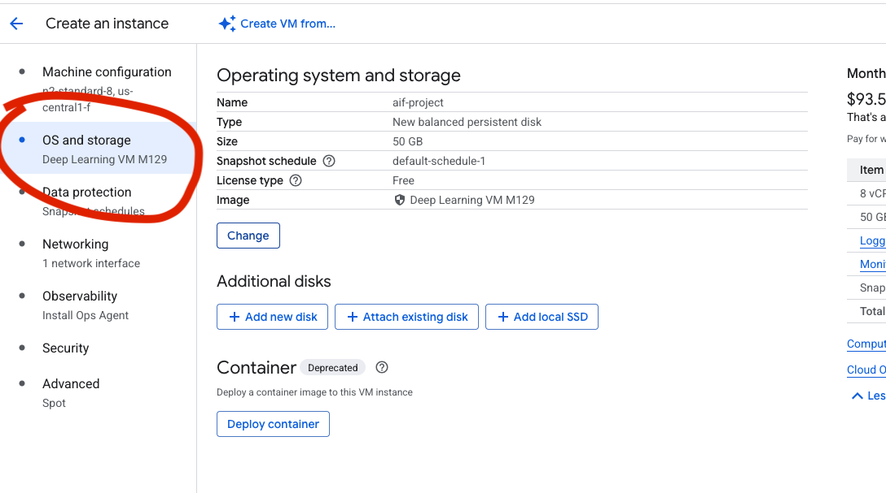  
 click on the "Change" button and select "Deep Learning in Linux" and select the first option.
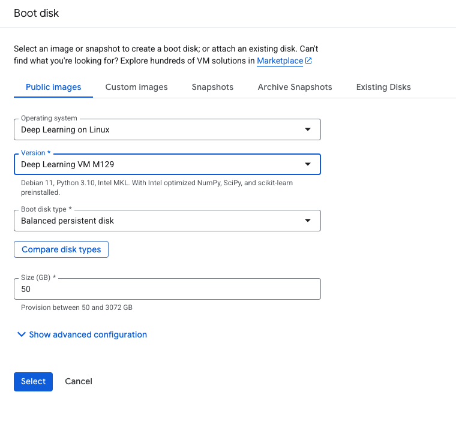  
Then in the __Networking__ section, set the following fields:
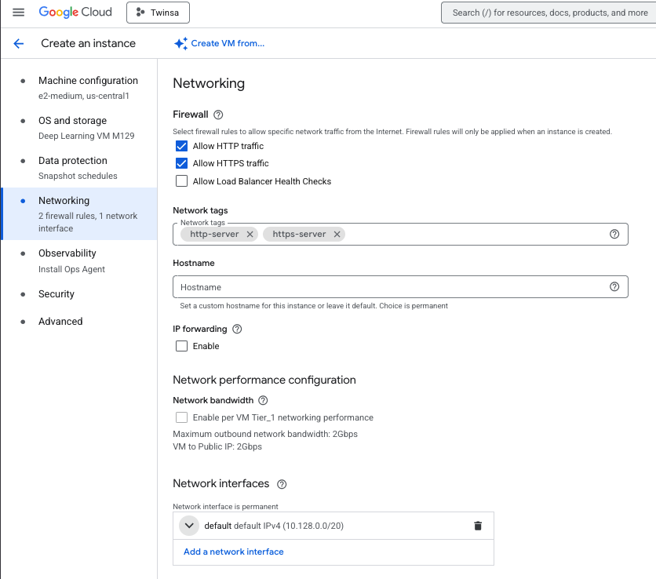  
In this same section under __Network interfaces__, click the ▾ arrow next to
__default default IPv4 (10.128.0.0/20)__.

Find __External IPv4 address dropdown__  and select  __Reserve static address__.
Give it a name like docker-vlm-static-ip and click on __Reserve__.  
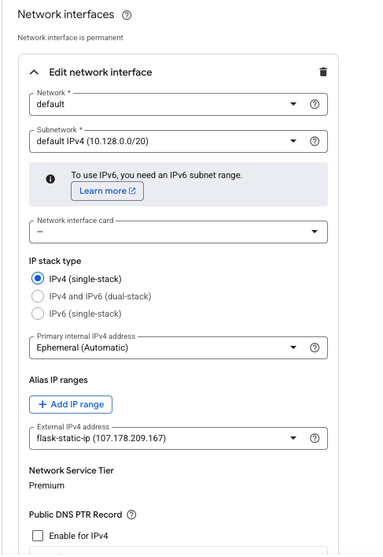  

We will also use spot instances to save money. Spot instances are instances that are available at a lower price than on-demand instances, but are not guaranteed to be available. They are a good way to save money, but you should be aware that they can be interrupted at any time.  
On the __Advanced__ section, set the following fields to use spot instances and automatically stop the instance when it is not in use:
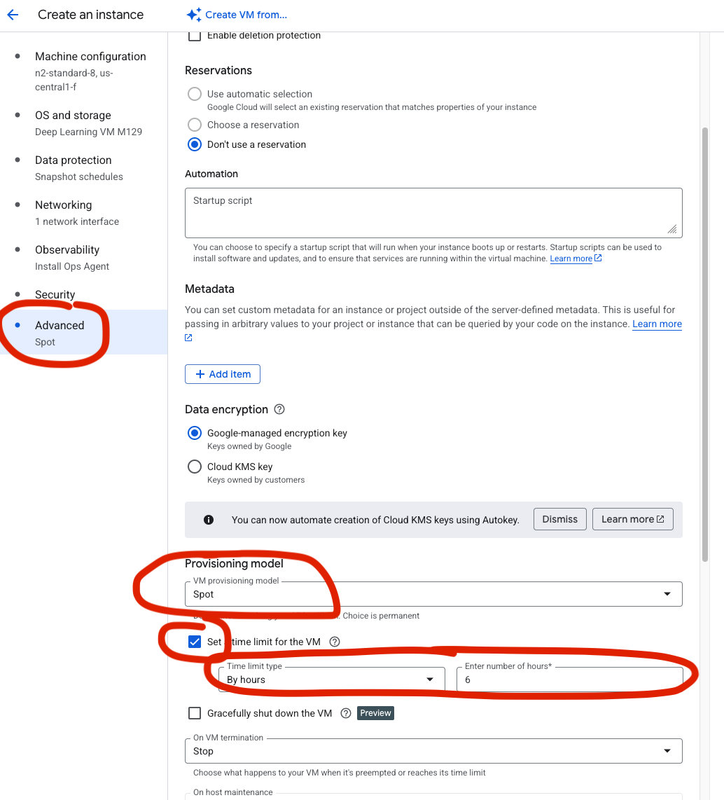  
Then click on the "Create" button to create the instance.

## 3. Install the GCloud SDK on your local machine
Now install the GCloud SDK on your local machine. Follow the instructions [here](https://cloud.google.com/sdk/docs/install).

Once the GCloud SDK is installed, run the following command to initialize it:
```console
gcloud init
```
This will guide you through the process of setting up your GCloud SDK. You will need to authenticate with your Google account and set a default project (the one you just created, _Advanced-AI_). No need to set a default region.

## 4. Connect to your instance
Once your instance is created, you can find its name in the VM instances list on the Google Cloud Platform console.
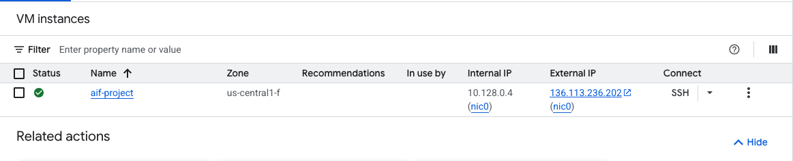  
You can connect to it using the following command:
```console
gcloud compute ssh --zone "us-central1-f" "advanced-ai-project"
```
or if your instance name or/and region are different:
```console
gcloud compute ssh --zone "region" "your_instance_name"
```
(replace `your_instance_name` and `region` with the actual instance name and region)
You can also directly get the command to connect to your instance by clicking on the arrow next to the __"SSH"__ button in the Google Cloud Platform console and then __"view gcloud command"__.
You should now be connected to your instance and see its terminal.

## 5. Install Docker on the instance
The "Deep Learning in Linux" disk image you selected in §2 already ships with the Docker engine, so we only need to add the `docker-compose` plugin and make sure the Docker daemon is running. On the instance terminal:
```console
sudo apt-get update
sudo curl -SL https://github.com/docker/compose/releases/download/v2.40.3/docker-compose-linux-x86_64 -o /usr/local/bin/docker-compose
sudo chmod +x /usr/local/bin/docker-compose
sudo systemctl start docker
sudo systemctl enable docker
```
(If you picked a different base image that does not ship Docker, follow the [official install guide](https://docs.docker.com/engine/install/debian/) on the instance first.)

Verify Docker is installed correctly:
```console
sudo docker --version
sudo docker-compose --version
```

## 6. Prepare your local project
Make sure your local VLM chatbot project (from the previous tutorial) has the following structure:
```
PP8_API_Docker/
├── api/
│   ├── Dockerfile
│   ├── main.py
│   ├── model.py
│   ├── schemas.py
│   ├── pyproject.toml
│   └── uv.lock
├── ui/
│   ├── Dockerfile
│   ├── app.py
│   ├── client.py
│   ├── pyproject.toml
│   └── uv.lock
├── docker-compose.yml
└── (other files from your VLM chatbot project)
```

Before deploying, we need to configure the firewall to allow traffic on the ports used by our application.

## 7. Configure firewall rules
On your local machine terminal (not on the instance), run the following commands to allow incoming traffic on ports 8000 (API) and 7860 (Gradio):
```console
gcloud compute firewall-rules create allow-vlm-api --allow tcp:8000
gcloud compute firewall-rules create allow-vlm-ui --allow tcp:7860
```

## 8. Deploy by copying files directly
We will now deploy our application by copying the files to the instance.

On the instance terminal, run the following command to get your current working directory:
```console
pwd
```
This gives you the path to the home directory of the user on the instance. You should see something like `/home/your_username`.

Now on a separate terminal on your local machine, navigate to your VLM chatbot project directory and run the following command to send the folder to the instance:
```console
gcloud compute scp --recurse --zone "us-central1-f" "." "advanced-ai-project":/home/your_username/vlm_chatbot
```

> The project ships a `.gcloudignore` (at the root of `PP8_API_Docker/`) so the host's `.venv/`, `__pycache__/`, `.git/` and similar build artifacts (close to 1 GB combined) are skipped during transfer. Without it the upload would take much longer, and the host's macOS Python venv on a Linux x86 instance is useless anyway — Docker rebuilds the venv inside each container.
Remember to replace `us-central1-f` with the actual region and `advanced-ai-project` with the actual instance name if it is different.
Then on the instance terminal, go to the folder:
```console
cd vlm_chatbot
```

Now start the application using docker-compose:
```console
sudo docker-compose up -d
```

The `-d` flag runs the containers in detached mode (in the background).

Now go to the Google Cloud Platform console to get the external IP address of your instance.
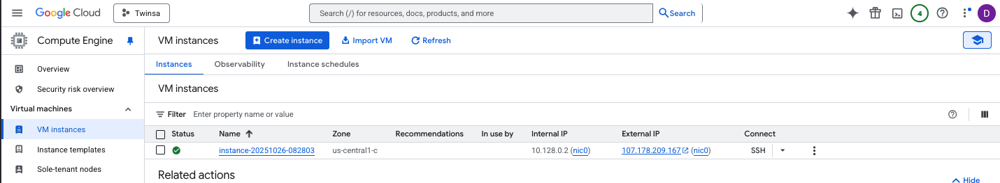

You should now be able to access:   
- The Gradio interface at `http://your_instance_ip:7860`  
- The API at `http://your_instance_ip:8000`

Test the Gradio interface by sending a text message and/or uploading an image and checking that the assistant replies correctly.

If you want to make changes to your application, simply modify the files on your local machine and repeat the `gcloud compute scp` command to copy the updated files to the instance. Then restart the containers:
```console
sudo docker-compose down
sudo docker-compose up -d
```

## 9. Deploy using Docker images
Instead of copying all the source files and building on the instance, we can build Docker images locally and transfer them to the instance. This approach is more efficient, especially for larger applications.

### Step 1: Build images locally
On your local machine, navigate to your VLM chatbot project directory and build the Docker images (we will use the --platform=linux/amd64 flag to build the images for the amd64 architecture. This is mostly useful for Macos users that are using an M chips and are by default building for the arm64 architecture):
```console
sudo docker build --platform=linux/amd64 -f api/Dockerfile -t vlm-chatbot-api:latest api
sudo docker build --platform=linux/amd64 -f ui/Dockerfile -t vlm-chatbot-ui:latest ui
```

Verify the images were created:
```console
sudo docker image ls
```

You should see both `vlm-chatbot-api` and `vlm-chatbot-ui` in the list.

### Step 2: Save images to tar files
Save the Docker images as tar files that can be transferred (for Windows users, you might need to use PowerShell or Git Bash to run these commands):
```console
sudo docker save vlm-chatbot-api:latest | gzip > vlm-chatbot-api.tar.gz
sudo docker save vlm-chatbot-ui:latest | gzip > vlm-chatbot-ui.tar.gz
```

These compressed tar files contain everything needed to run the containers, including all dependencies and your code.

### Step 3: Transfer images to the instance
Use `gcloud compute scp` to transfer the image files to your instance:
```console
gcloud compute scp --zone "us-central1-f" vlm-chatbot-api.tar.gz advanced-ai-project:/home/your_username/
gcloud compute scp --zone "us-central1-f" vlm-chatbot-ui.tar.gz advanced-ai-project:/home/your_username/
```
We can now update the docker-compose.yml file to use the images instead of building them on the instance.  
Replace the build section with the image section (keep the healthcheck and `condition: service_healthy` from the original compose file so the UI waits for the model to finish loading):
```yaml
services: # services to run
  api: # name of the first service
    image: vlm-chatbot-api:latest
    ports:
      - "8000:8000" # specify port mapping
    volumes:
      - huggingface-cache:/root/.cache/huggingface
    healthcheck:
      test:
        - CMD
        - python
        - -c
        - "import urllib.request,sys; sys.exit(0 if urllib.request.urlopen('http://localhost:8000/health').status==200 else 1)"
      interval: 10s
      timeout: 5s
      start_period: 120s
      retries: 5

  ui:
    image: vlm-chatbot-ui:latest
    ports:
      - "7860:7860" # specify port mapping
    environment:
      API_URL: http://api:8000
    depends_on:
      api:
        condition: service_healthy # wait until the API healthcheck passes

volumes:
  huggingface-cache:
```
Now transfer the docker-compose.yml file:
```console
gcloud compute scp --zone "us-central1-f" docker-compose.yml advanced-ai-project:/home/your_username/
```

### Step 4: Load images on the instance
Connect to your instance:
```console
gcloud compute ssh --zone "us-central1-f" "advanced-ai-project"
```

Load the Docker images from the tar files:
```console
sudo docker load < vlm-chatbot-api.tar.gz
sudo docker load < vlm-chatbot-ui.tar.gz
```

Verify the images are loaded:
```console
sudo docker image ls
```

You should see both images listed.

### Step 5: Run the application
Start the application using docker-compose:
```console
sudo docker-compose up -d
```

Check that the containers are running:
```console
sudo docker-compose ps
```

Your application should now be accessible at:
- The Gradio interface at `http://your_instance_ip:7860`
- The API at `http://your_instance_ip:8000`

### Step 6: Updating the application
When you make changes to your application, follow these steps:

1. On your local machine, rebuild the images:
```console
sudo docker build --platform=linux/amd64 -f api/Dockerfile -t vlm-chatbot-api:latest api
sudo docker build --platform=linux/amd64 -f ui/Dockerfile -t vlm-chatbot-ui:latest ui
```

2. Save the updated images:
```console
sudo docker save vlm-chatbot-api:latest | gzip > vlm-chatbot-api.tar.gz
sudo docker save vlm-chatbot-ui:latest | gzip > vlm-chatbot-ui.tar.gz
```

3. Transfer to the instance:
```console
gcloud compute scp --zone "us-central1-f" vlm-chatbot-api.tar.gz advanced-ai-project:/home/your_username/
gcloud compute scp --zone "us-central1-f" vlm-chatbot-ui.tar.gz advanced-ai-project:/home/your_username/
```

4. On the instance, stop the containers, load the new images, and restart:
```console
sudo docker-compose down
sudo docker load < vlm-chatbot-api.tar.gz
sudo docker load < vlm-chatbot-ui.tar.gz
sudo docker-compose up -d
```

### Cleanup local tar files
After successful deployment, you can delete the tar files to save disk space:

On your local machine:
```console
rm vlm-chatbot-api.tar.gz vlm-chatbot-ui.tar.gz
```

On the instance:
```console
rm vlm-chatbot-api.tar.gz vlm-chatbot-ui.tar.gz
```

### Why using Docker images instead of copying files?
Building Docker images and transferring them to the instance provides several advantages:
- **Faster deployment**: No need to rebuild on the instance and the instance doesn't need to download and compile dependencies (the image is already built and ready to run)
- **Consistent builds**: The exact same image that works on your local machine runs on the instance
- **Easier troubleshooting**: If it works locally, it will work on the instance


## 10. Troubleshooting

Here are common issues you might encounter and their solutions:

### Firewall Issues
**Problem:** Cannot access the application via external IP.
**Solution:**
- Verify the firewall rules were created: `gcloud compute firewall-rules list`
- Make sure the rules allow tcp:8000 and tcp:7860
- Check if the containers are running on the instance: `sudo docker-compose ps`

### SSH Connection Problems
**Problem:** Cannot SSH into the instance.
**Solution:**
- Verify the instance is running in the GCP console
- Check your zone is correct (should be `us-central1-f`)
- Try adding `--verbosity=debug` to the SSH command to see detailed error messages
- Make sure your gcloud SDK is authenticated: `gcloud auth list`

### Docker Issues
**Problem:** Docker commands fail or containers don't start.
**Solution:**
- Verify Docker is installed: `sudo docker --version`
- Check Docker service status: `sudo systemctl status docker`
- View container logs: `sudo docker-compose logs`
- Restart Docker service: `sudo systemctl restart docker`
- Check disk space: `df -h` (Docker images can take a lot of space)

### Port Already in Use
**Problem:** Error message "Address already in use" when starting containers.
**Solution:**
- Stop all running containers: `sudo docker-compose down`
- Check if processes are using the ports: `sudo lsof -i :8000` and `sudo lsof -i :7860`
- Kill the processes if needed: `sudo kill -9 <PID>`

### File Transfer Issues
**Problem:** `gcloud compute scp` fails or is very slow.
**Solution:**
- Check your internet connection
- Verify the instance name and zone are correct
- For large files, consider using compression: `tar -czf` before transfer
- Check disk space on both local machine and instance: `df -h`

### Model Fails to Download
**Problem:** API container fails to start because the SmolVLM weights cannot be downloaded.
**Solution:**
- Verify the instance has internet access (HuggingFace Hub must be reachable)
- The first boot downloads ~500 MB into the `huggingface-cache` named volume — wait for it to complete (the API healthcheck has a 120 s start period)
- Check the API logs: `sudo docker-compose logs api`
- If the volume got corrupted, recreate it: `sudo docker-compose down -v` then `sudo docker-compose up -d`

### Containers Build but Don't Communicate
**Problem:** Gradio interface cannot connect to the API.
**Solution:**
- Verify both containers are running: `sudo docker-compose ps`
- Check the `API_URL` env var in the `ui` service of `docker-compose.yml` is set to `http://api:8000`
- Make sure the `depends_on` directive is in the `docker-compose.yml`
- Check logs for both services: `sudo docker-compose logs`

### Out of Disk Space
**Problem:** Cannot build images or load images due to insufficient disk space.
**Solution:**
- Remove unused Docker resources: `sudo docker system prune -a`
- Check disk usage: `df -h`
- Remove old images: `sudo docker image prune -a`
- Delete the tar.gz files after loading images: `rm *.tar.gz`
- Consider increasing the instance's disk size in GCP console

### Docker Images Not Loading
**Problem:** `docker load` command fails or doesn't show the image.
**Solution:**
- Verify the tar.gz file is not corrupted: check file size with `ls -lh`
- Make sure you used `gzip` when saving: `docker save ... | gzip > file.tar.gz`
- Try decompressing first: `gunzip vlm-chatbot-api.tar.gz` then `docker load < vlm-chatbot-api.tar`
- Check Docker service is running: `sudo systemctl status docker`

## 11. Cleanup
To cleanup, you can stop the Docker containers and the instance:

On the instance terminal:
```console
# Stop containers
sudo docker-compose down

# Remove Docker images (optional)
sudo docker image rm vlm-chatbot-api:latest vlm-chatbot-ui:latest

# Remove tar files
rm vlm-chatbot-api.tar.gz vlm-chatbot-ui.tar.gz
```

You can stop the instance from the Google Cloud Platform console.
You can delete it if you want to completely remove it, but you might want to keep it for your project since it is configured now.
If you choose to keep it, you can start it again later.

## 12. Do not forget to stop the instance!!!
**Always remember to stop the instance when you are not using it to avoid unnecessary charges.** You have a limited $50 credit so be careful with your usage.
